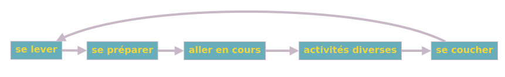

# Comment marche le jeu?

Depuis le commit ["Implémentation des crédits et fin du remaniement de la logique du jeu." (aa692b3)](https://github.com/Lecodeurenretard/Trophee-NSI/commit/aa692b3e8b5f55c6ee741e53cb5120b431b88c55), le _control flow_ du programme à drastiquement changé. Ce fichier décrit donc comment le jeu fonctionne dans son ensemble.

## 1. Le système d'états
### Une machine à état?
Un état est une subdivision du programme qui ne s'occupe de ne faire qu'une seule tâche. Par exemple, on peut découper la journée d'un écolier en états avec l'écolier ne pouvant être que dans un état à a fois, il vivra donc les états suivants:
1. se lever
2. se préparer à aller en cours
3. être en cours
4. activités diverses
5. se coucher

Pour pouvoir plus facilement voir quel état va déclencher le suivant, on les représentes dans un graphe:
<!--Lien pour le modifier: http://graphonline.top/fr/?graph=LWzxFmwOqxFHmRQC -->

Pour notre jeu, c'est la même chose mais un état peut mener à plusieurs suivant des conditions externes.

### La machine du jeu
Voici le graphe:  
  
_potentiellement pas à jour, [la version à jour](http://graphonline.top/fr/?graph=OMlRPwRCzhQxYjcl)_

Un comportement typique serait:
1. Commencement à l'écran-titre
	1. Si le joueur choisit de regarder les crédits, il les regarde puis est renvoyé à l'écran d'accueil.
	2. Sinon il peut aussi choisir de commencer le jeu.
2. Avant de commencer le jeu, il faut que le joueur entre son nom et qu'il regarde le faux chargement (skip en mode débug).
3. L'écran de nouveau combat apparait pour quelques secondes.
4. Le joueur combat le premier monstre
	1. Le joueur choisit son attaque.
	2. Les attaques sont affichées et appliquées suivant leurs vitesses.
		- Si le monstre meurt et que ce n'est pas le dernier combat, on déclenche un nouveau combat.
		- Si le joueur meurt ou qu'il a vaincu le dernier monstre, on affiche l'écran de game over.
4. Un deuxième combat...
4. ...
5. L'écran de game over apparait.
	- Ici "Game Over" veut juste dire que le joueur doit commencer une nouvelle partie pour jouer plus (comme sur les bornes d'arcades), ainsi quand il gagne, il est en game over.
	- Si le joueur a coché le paramètre `fermeture_automatique`, le jeu se ferme sinon il est redirigé sur l'écran titre.

### Et dans le code, ça donne quoi?
La liste des états se trouve dans l'énumération [`Jeu.Etat`](../sources/Jeu.py), les variables globales `Jeu.etat` et `Jeu.precedent_etat` permettent d'accéder à l'état actuel du jeu; par contre pour le changer, il faut utiliser `Jeu.changer_etat()`.  
Chaque état possède une fonction correspondante (définies dans le fichier [fonctions_etats.py](../sources/fonctions_etats.py)).

Mis à part les états `GAME_OVER`, `CREDITS` et `PREPARATION`, toutes les fonctions respectent le principe que j'appelle celui de _la boucle d'état_ (je ne sais pas s'il a un nom). Dans une application, il existe ce que l'on appelle une _boucle principale_, la nôtre se trouve dans [main.py](../sources/main.py) et se contente de lancer la fonction correspondante à l'état actuel; la boucle d'état est une boucle principale pour un état.

La boucle d'état ne doit pas être interrompue, c'est-à-dire qu'elle ne doit pas appeler une fonction qui empèche le retour à la boucle d'état pour une période longue; la seule exeption est `Jeu.commencer_frame()` qui attend assez de temps pour que le jeu ne tourne pas au-dessus de 60fps.

### Les interruptions
Les interruptions sont en quelques sortes des mini-états, ils doivent gèrer leurs évènements et dessiner ce qu'ils doivent afficher sur une surface qu'ils renvoierons.

Comme le nom ne l'indique pas, les interuptions ne cassent pas la règle décrite précédement car ce sont en fait des générateurs, ils empèchent juste la boucle d'exécuter autre chose qu'eux.

Pour distinguer les interruptions, il faut utiliser l'alias `Interruption` en type de retour.

## 2. Les animations
On distingue deux types d'animations: celles qui sont préfaites et qui proviennent d'un fichier GIF ou vidéo et celles qui doivent être générées par le jeu. Par exemple, si jamais je veux faire breakdance Esquimo pour une attaque, je devrait dessiner chaque frame et les jouer les unes après les autres; mais si je veux simplement le sauter, je n'ai juste qu'a changer sa position verticale.

### Les Animations de GIF/séquences PNG
Commençons par le premier cas, soit un gif, prenons exemple.gif:  
  
Malheureusement, Pygame ne permet pas d'afficher les gifs en l'état, il faut d'abord le découper en frames; pour cette tâche, j'utilise [EzGif](https://ezgif.com/split). Une fois le gif tranché, il faut mettre les images dans un sous-dossier de [/data/anim/](../data/anim/)([`Constantes.Chemins.ANIM`](../sources/Constantes/Chemins.py)).
Nous sommes enfin en mesure d'afficher les images avec la fonction `dessiner_gif()` de [dessin.py](../sources/dessin.py). Pour le second argument il nous faut un pattern glob, cette fonction ne demande pas de grand savoir dans le domaine et la seule chose à savoir, c'est qu'il faut mettre une étoile à la place des noms de fichiers.  
Pour un exemple, allez voir [ex_gif.py](../exemples/ex_gif.py)

### Les animations dans le code
Dans le second cas, il sera nécessaire d'utiliser les classe du fichier [Animation.py](../sources/classes_utiles/Animation.py). On en documente 6:
- `InterpolationLineaire`
- `Deplacement`
- `Gradient`
- `MultiInterpolation`
- `MultiGradient`
- `MultiDeplacement`

#### Parenthèse mathématique sur le LERP
La premiere classe n'est qu'un moyen d'utiliser LERP.  
Pour comprendre LERP, disons que l'on veuille déplacer un sprite horizontalement, sa position horizontale ira de $x_1$ à $x_2$ en un temps $t$, notre objectif est de trouver une fonction trouvant la position horizontale de $x_1$ à $x_2$ après $t\%$ du temps du déplacement. C'est exactement le problème que vient résoudre LERP. Nous avons donc
$$
\text{LERP}(x_1, x_2, t) = x_1 + (x_2 - x_1)\frac{t}{100}
$$
Autrement dit, LERP prend $t$ pourcents de la longueur du chemin à parcourir et l'ajoute au départ pour avoir le point d'arrivé.  
On remarque quand $t=0\%$, $\text{LERP}(x_1, x_2, 0) = x_1$, quand $t = 100\%$, $\text{LERP}(x_1, x_2, 1) = x_1 + x_2 - x_1 = x_2$. On s'attendrait aussi à ce que si $t = 50\%$ alors la fonction renvoie la moyenne de $x_1$ et $x_2$ pour indiquer le milieu, vérifions cela:  
$\text{LERP}(x_1, x_2, 50) = x_1 + (x_2 - x_1)\frac{50}{100} = \frac{2x_1}{2} + \frac{x_2-x_1}{2} = \frac{x_1 + x_2}{2}$  
C'est en effet le cas.  
En réalité, quand on parle de LERP, on préfère garder entre 0 et 1 car si on veut faire le tier du chemin, on prend $t=\frac{1}{3}$ au lieu de $t=\frac{100}{3}$.  
La formule finale de LERP est:
$$
\text{pour tout} \, x_1 \, \text{et} \, x_2 \, \text{réels}, t \in [0; 1] \\
\text{LERP}(x_1, x_2, t) = x_1 + (x_2 - x_1)t
$$
Et concrètement, c'est tout ce que fait `InterpolationLineaire.calculer_valeur_s()`,
à une chose près, la méthode applique ce que l'on appelle des fonctions d'easing.  
Les fonctions d'easing permettent d'obtenir une transition plus naturelle au début et à la fin d'un LERP, c'est un concept très difficle à décrire en texte seulement; j'ai donc créé un **[graphique interactif Desmos](https://www.desmos.com/calculator/rrinotdfez)** pour visualiser le tout. <!--Si vous clickez sur le métronôme en haut à gauche, $t$ devrait augmenter et un point défiler entre 0 et 1 sur la droite $y=1$, ce point est contrôlé par $p$ (tout en bas des définitions).-->

#### Retour sur les classes
C'est bon il n'y a plus de maths, on se concentre maintenant sur la programation.  
La classe `InterpolationLineaire` possède deux méthodes:
- `.calculer_valeur()`: Un LERP avec `x1 = debut`, `x2 = fin`, `t = t`.
- `.generateur()`: Renvoie un générateur dont la valeur de retour va de `debut` à `fin` en `nb_iterations` appels.

Les autres classes ont les mêmes méthodes. Chaque méthode est disponible en version statique (avec pour suffixe `_s`) et en version non statique, pour les versions non statiques, la version non statique prend les valeurs passées à l'objet avec le constructeur.